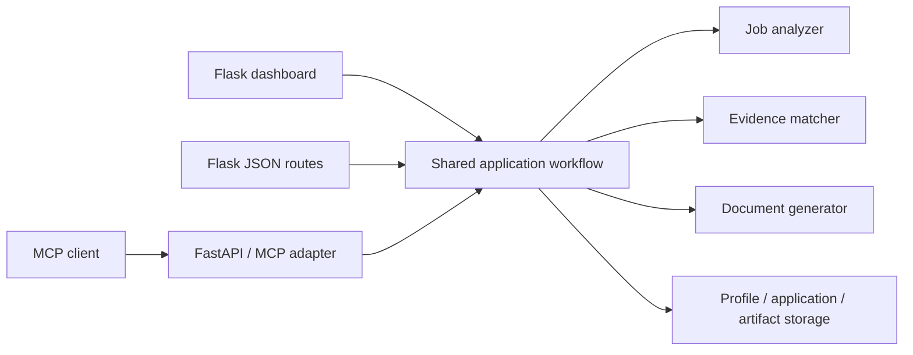

# Proposed Architecture

## Purpose and scope

This document describes the recommended architecture for the Job Application Assistant and the first implementation step: one shared application workflow used by the Flask UI and MCP/API adapters. The goal is to reduce duplicated behavior, keep evidence rules consistent, and make document exports dependable without introducing a large framework or premature abstractions.

## Current state

The project has a useful separation of concerns already:

- Flask provides the browser dashboard.
- FastAPI exposes MCP-oriented tools and HTTP endpoints.
- Pydantic schemas model candidate profiles, job analyses, and match results.
- Service modules perform job-description analysis, evidence matching, and document generation.
- `app/services/workflow.py` contains shared workflow functions.

The main architectural gap was inconsistent orchestration. The Flask dashboard and Flask document routes now use the application services in `app/services/application_services.py`; FastAPI/MCP remains a thin typed adapter over the shared workflow and document services. Streamlit is retained only as a deprecated prototype.

## Recommended layers

### 1. Interfaces / delivery adapters

Responsibilities: accept input, validate transport-specific request formats, call an application workflow, and format the response.

Current implementations:

- Flask dashboard and Flask blueprints
- FastAPI endpoints
- MCP tools exposed through the FastAPI service

Interfaces should not implement matching rules, selection defaults, document composition, or persistence policy. They may translate domain/application errors into HTTP status codes or user-facing messages.

### 2. Application workflows / use cases

Responsibilities: coordinate domain services to complete user goals and establish consistent behavior across transports.

Initial shared use cases:

- Analyze a job against a candidate profile.
- Generate selected CV content from a reviewed analysis.
- Build a document bundle when the user explicitly requests multiple documents.

The workflow layer should accept typed Pydantic domain models and return typed results or predictable dictionaries. It should remain independent of Flask request objects, FastAPI response classes, and MCP transport types.

### 3. Domain models and rules

Responsibilities: define the valid data and evidence rules of the product.

Existing Pydantic schemas and matching/generation rules remain the source of truth. Key invariants:

- VERIFIED claims require candidate-profile evidence.
- TRANSFERABLE claims must remain framed as transferable.
- FAMILIARITY must not be promoted to professional experience.
- MISSING or CONFLICT requirements must never become claims of experience.
- User-selected requirements must be normalized consistently before generation.

### 4. Infrastructure

Responsibilities: interact with external systems and local resources.

Current infrastructure includes JSON profile storage, SQLite application history, local file storage, LaTeX compilation, and the OpenAI client. These can remain as-is for the immediate workflow-unification step. Repository interfaces and provider abstractions should be added when there is a concrete need for alternate storage or model providers, not as a prerequisite for fixing orchestration.

## Target request flow



For job analysis, every entrypoint should follow the same sequence:

1. Validate the minimum job-description input.
2. Load or accept the candidate profile.
3. Analyze the job description.
4. Match requirements against candidate evidence.
5. Return the same job and match models to the caller.

For CV generation:

1. Accept a profile, job analysis, match analysis, and explicit selected requirements.
2. Apply the shared selection default only when the selection is omitted; an explicitly empty selection remains empty.
3. Generate LaTeX through the same document service.
4. Compile and return a PDF only in the transport layer or a dedicated artifact operation, while preserving the same generated LaTeX.

## Dependency direction

Dependencies should point inward:

- Delivery adapters depend on application workflows.
- Application workflows depend on domain models and service operations.
- Domain logic must not depend on Flask, FastAPI, MCP, or response objects.
- Infrastructure may be called by application workflows through narrow functions; it must not control evidence decisions.

Avoid importing Flask or FastAPI modules from services or domain code.

## Proposed package layout (gradual target)

Do not move all files immediately. Keep the current project layout while consolidating behavior, then consider gradual naming cleanup:

```text
app/
  models/                 # typed domain and request/response schemas
  services/               # analyzer, matcher, generation, profile operations
  workflows/               # optional future home for application use cases
  api/
    flask_routes/          # Flask delivery adapters
    fastapi_mcp/           # MCP/HTTP delivery adapter
  mcp/                     # MCP tool definitions and adapters
  database/                # SQLite persistence
  templates/               # Flask UI
```

For now, `app/services/workflow.py` can remain the shared workflow module. A move to `app/workflows/` can happen later without changing behavior.

## Error handling

- Workflow functions should raise meaningful domain/application exceptions and avoid silently hiding failures.
- HTTP/MCP adapters translate known errors to appropriate responses.
- A cover letter requiring an unavailable API key should not make CV generation fail.
- A PDF compilation failure should clearly report the failure while leaving the generated `.tex` source available where practical.
- Avoid broad exception swallowing in workflow code; distinguish expected optional failures from unexpected defects.

## Document and artifact lifecycle (next architectural phase)

CV and cover-letter outputs should eventually be represented as artifacts with metadata such as:

- application identifier
- artifact type and media type
- generated timestamp
- profile/job/match inputs or version references
- selected requirements
- storage path and generation status

Persist and download the same artifact rather than recomputing it on each request. This prevents stale downloads and makes the browser workflow recoverable. The first workflow-unification implementation does not require a storage migration; it should leave a clean seam for this phase.

## AI provider boundary (later phase)

Keep provider selection separate from domain rules. When multiple models or local inference are needed, introduce a small provider interface for JSON completion and prose generation. Until then, keep the current OpenAI integration behind the existing LLM service module and avoid passing provider-specific SDK objects through workflows.

## Security and operational considerations

- Keep candidate profile data and application artifacts private and excluded from source control.
- Restrict artifact download routes to safe paths/IDs rather than accepting arbitrary filesystem paths.
- Avoid logging job descriptions, profile content, generated documents, API keys, or other private material.
- Configure production WSGI/ASGI servers and trusted hosts/origins before public deployment.
- Keep the development Flask server for local development only.

## Incremental implementation plan

### Phase 1 — unify orchestration (implemented)

- Make the shared workflow and application services the orchestration path for job analysis, CV generation, cover letters, and exports.
- Use them from the Flask dashboard, Flask document routes, and MCP adapters/endpoints.
- Keep transport layers responsible for parsing requests, mapping errors, and returning responses.
- Preserve current public routes and payload shapes where feasible.
- Maintain behavior tests proving document downloads, note forwarding, and selection defaults remain consistent.

### Phase 2 — reliable document artifacts

- Introduce artifact metadata and a stable application identifier.
- Save generated LaTeX and PDF together with the reviewed selection.
- Serve downloads by artifact/application ID and preserve LaTeX when PDF compilation is unavailable.
- Add browser tests covering analysis, selection, generation, and downloads.

### Phase 3 — storage and provider boundaries (only when needed)

- Introduce profile/application/artifact repositories if storage options grow or persistence tests become difficult.
- Introduce an AI-provider interface if more than one provider or local model is required.
- Keep changes incremental and behavior-preserving.

## Acceptance criteria for Phase 1

- The Flask dashboard uses the shared analysis and document workflow.
- Flask API and MCP analysis use the same workflow.
- MCP CV generation uses the shared document workflow.
- Requirement selection treats omitted and empty selections distinctly.
- Existing endpoint shapes remain compatible unless a deliberate versioned change is documented.
- Smoke and workflow tests pass after the refactor.
