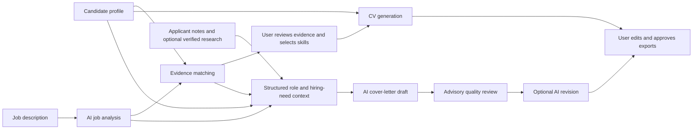

# Job Application Engine

A local-first, evidence-led job application assistant. Flask is the primary browser application. FastAPI provides a thin typed MCP/tooling layer, while the core matching, document generation, and profile logic stays shared and reusable.

Use the Flask dashboard at `http://127.0.0.1:5000/dashboard`. FastAPI provides typed API and MCP access.

New here? Start with the [Quick start](QUICKSTART.md), then use the [project guide](PROJECT_GUIDE.md) for architecture, workflows, privacy, and troubleshooting.

## Start locally

Requires Python 3.12+. The recommended cross-platform setup creates the virtual environment, installs dependencies, and creates a private `.env` file:

```bash
python scripts/setup.py install
python scripts/setup.py run
```

The helper also provides `python scripts/setup.py test`, `python scripts/setup.py clean`, and `python scripts/setup.py init-settings`.

To begin with a fictional base CV rather than an empty profile, run `python scripts/setup.py init-profile`. See [base-cv/](base-cv/) for details; replace every example value with accurate personal information.

Or run the services separately:

```bash
python app/flask_app.py --port 5000
python -m uvicorn app.api.fastapi_mcp.server:app --host 0.0.0.0 --port 8000
```

Copy `.env.example` to `.env` and set `OPENAI_API_KEY` for AI job-description extraction, evidence matching, and role-specific cover-letter generation. Job extraction is AI-only: if the key is missing or the provider is unavailable, the app reports an error instead of silently switching to regex/keyword extraction. Evidence matching may still use its local fallback. Install `latexmk` or `pdflatex` to compile downloadable CV PDFs.

## Candidate profile

On first launch, an empty `data/candidate_profile.json` is created. Edit the profile either in the Flask dashboard or directly in the JSON file, then save. The profile is the source of truth; keep only accurate details and label studied skills as `FAMILIARITY`. Example skill:

```json
{"name":"SysML","status":"FAMILIARITY","evidence":["Completed introductory coursework"]}
```

Profile data and generated documents are stored locally as JSON and files; no database is required. When AI-assisted analysis, cover-letter generation, or French CV translation is used, relevant job and candidate document text is sent to the configured OpenAI API. French CV translations are cached in memory for the running process only. `data/applications/` and `.env` are ignored by Git. Do not commit private application materials.

## Personal settings

The setup command creates a private [user settings template](config/user-settings.example.yaml) at `config/user-settings.yaml`. Use it to control document language (`auto`, `english`, or `french`), CV selection defaults, the number of experience/project entries, cover-letter tone, technical detail, target length, priority skills, and extra writing instructions. In `auto` mode, French job descriptions produce a French CV and cover letter. This private file is ignored by Git.

Settings guide the generated documents but do not replace the core evidence rules: unsupported experience, credentials, metrics, and skills must not be presented as verified facts.

## Current MVP behavior

- Job descriptions are extracted with the configured OpenAI model. Extraction failures are visible and do not silently produce keyword-parser results. Evidence matching may use its local fallback if AI matching is unavailable.
- Requirements are compared against profile skills, experience, and projects. The AI classifier must cite profile evidence for VERIFIED or TRANSFERABLE matches; familiarity and unsupported gaps remain visibly labeled.
- The human review panel focuses on technical skills, tools, and engineering domains. General soft skills such as communication and teamwork are excluded from technical CV selection.
- A CV is rendered from profile evidence. Selected requirements determine skill placement and prioritize relevant experience; unsupported requirements can be added explicitly as skills when the user chooses them. Existing experience wording is preserved while relevant bullets are prioritized.
- Generated reports and downloads are stored as local files under `data/applications/`.
- The API is available at `/docs` when running FastAPI.

## Agentic application workflow

The assistant uses a **bounded, human-in-the-loop AI workflow** rather than an unrestricted autonomous agent. Each stage has a specific input and output; the model cannot silently change the candidate profile or submit an application. The user reviews the analysis, chooses which requirements to emphasize, edits the cover letter, and decides what to export.



### What the stages do

1. **Analyze the role:** AI extracts role details, responsibilities, requirements, and likely activities from the supplied job description. It also identifies its predominant language for document-language selection.
2. **Match evidence:** requirements are compared with the profile's skills, experience, and projects. When configured AI matching fails, a deterministic local matcher is used and the analysis is labeled as a fallback.
3. **Prepare a writing brief:** a structured engine organizes the hiring need, job context, supported evidence, role intersections, learning gaps, candidate narrative, and writing preferences. This is preparation logic, not a separate autonomous AI agent. Company facts are not invented; external research is used only when supplied as verified.
4. **Generate documents:** the CV is rendered from reviewed profile data and selections. The cover-letter model uses the structured brief and evidence rules. If the configured quality review indicates revision is needed, an optional editor pass may revise the draft. French CV translation is a separate AI translation step when French output is selected.
5. **Keep the user in control:** review the match labels and selected skills, check the generated CV and letter, and make any edits before downloading. Quality and factuality checks are advisory, not guarantees.

### Available tool/API layer

The FastAPI service exposes typed endpoints under `/docs`, and its MCP registry includes profile retrieval, job analysis, CV generation, and cover-letter generation/export tools. These are callable workflow operations—not an autonomous planner or an agent that independently chains tools, researches the web, or applies for jobs. Flask, FastAPI, and MCP share the same core workflow and evidence rules.

## Documentation

- [Quick start](QUICKSTART.md): install and run the application.
- [Project guide](PROJECT_GUIDE.md): architecture, workflows, privacy, testing, and troubleshooting.
- [Architecture](ARCHITECTURE.md): detailed layering and future design boundaries.
- [Professionalization plan](PRODUCTION_PLAN.md): database-free product direction and release roadmap.

## Notes

AI extraction can still misread a job description. Review the extracted requirements before selecting them. The CV template follows the section and macro style of the existing `resume.tex`; review generated documents before submission.

## Implementation boundaries

- AI extraction and matching can still misread a job description or evidence. Review the analysis and generated document before relying on them.
- The model output is validated against the profile evidence IDs, but this is not a full fact checker or recruiter decision.
- The generated text check flags literal mentions of missing requirements and some likely familiarity overclaims. It is not a full claim-by-claim fact checker; review every document against the profile.
- PDF export requires a local `latexmk` or `pdflatex` installation. LaTeX source files remain available when no compiler is installed.
- AI job extraction and role-specific cover-letter generation require `OPENAI_API_KEY`. Template-based CV generation works without it only when job and match data have already been provided.
